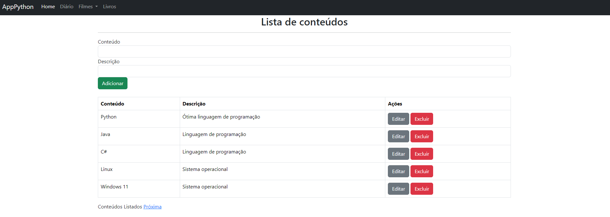
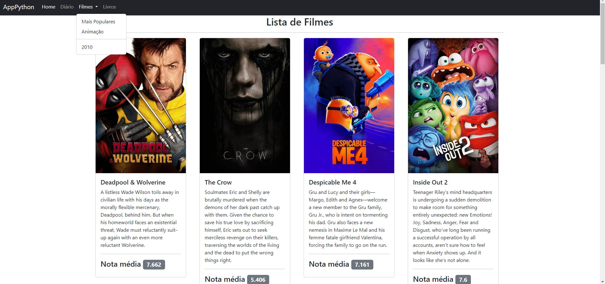
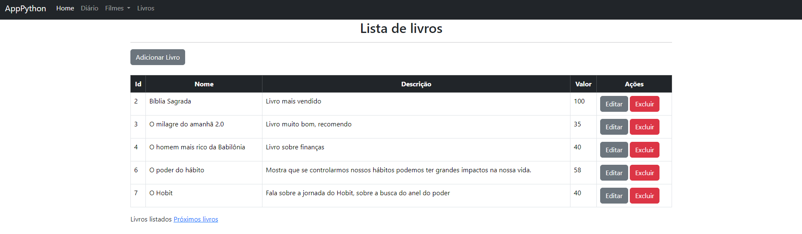
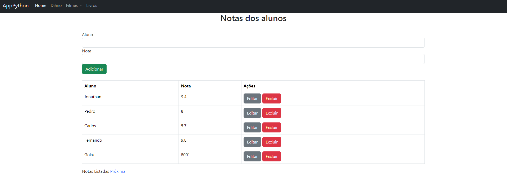

# Projeto de Aplicação Flask para Gerenciamento de Livros e Conteúdos

Este é um projeto de uma aplicação web desenvolvida com o framework Flask. A aplicação permite o gerenciamento de livros, conteúdos, filmes e notas de alunos. Ela foi projetada para oferecer funcionalidades como cadastro, atualização, listagem e exclusão de registros. O sistema utiliza SQLite como banco de dados e está organizado em diferentes módulos.

## Funcionalidades Principais

- **Gerenciamento de Livros**: Permite adicionar, listar, atualizar e excluir livros.
- **Gerenciamento de Conteúdos**: Permite criar, editar e remover diferentes tipos de conteúdos.
- **Gerenciamento de Filmes**: Listagem de filmes por categorias, como "Mais Populares", "Animação", entre outros.
- **Gerenciamento de Notas**: Cadastro de notas dos alunos, com possibilidade de edição e exclusão.

## Tecnologias Utilizadas

- **Flask**: Framework web para Python.
- **SQLAlchemy**: ORM para integração com bancos de dados.
- **Bootstrap**: Framework de estilização para criação de uma interface amigável.
- **SQLite**: Banco de dados utilizado para armazenar as informações.

## Como Rodar o Projeto

1. Clone o repositório:
    ```bash
    git clone https://github.com/seu-usuario/seu-repositorio.git
    ```
2. Instale as dependências:
    ```bash
    pip install -r requirements.txt
    ```
3. Inicie o servidor Flask:
    ```bash
    python -m flask --app projeto run --debug
    ```

4. Acesse a aplicação no navegador:
    ```
    http://localhost:5000
    ```

## Imagens do Projeto em Execução




